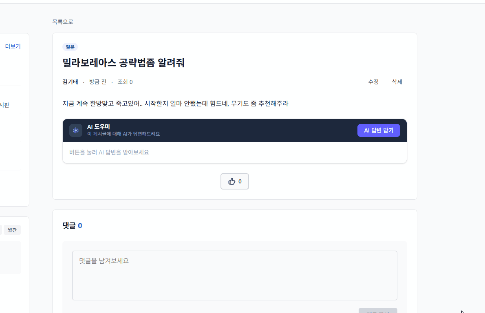
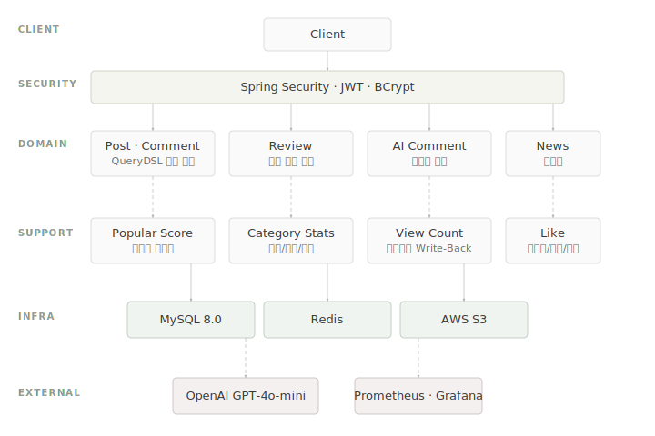

# GamerCommunity

게임별 게시판, 리뷰, AI 댓글 기능을 제공하는 게임 커뮤니티 백엔드 서버입니다.

---

## Demo




---

## Architecture



---

## Tech Stack

| 구분 | 기술 |
| --- | --- |
| **Backend** | Spring Boot 3.2.5 · Java 17 |
| **Database** | MySQL 8.0 · JPA · QueryDSL 5.0 |
| **Cache** | Redis (Lettuce) |
| **Auth** | Spring Security · JWT (jjwt 0.12) |
| **Storage** | AWS S3 |
| **Monitoring** | Prometheus · Grafana · Actuator |

---

## Key Features

### 게시판

게임별 게시판에서 게시글을 작성하고, 태그(공략/일반/질문/정보)와 정렬(최신/조회수/추천/댓글수) 조건으로 필터링할 수 있습니다. QueryDSL 동적 쿼리를 사용하여 조건 조합에 따라 쿼리를 유연하게 생성합니다.

### 조회수 처리 (인메모리 Write-Back)

조회수를 `ConcurrentHashMap`에 인메모리로 누적한 뒤, 스케줄러가 주기적으로 JDBC `batchUpdate`를 통해 DB에 일괄 반영합니다. `ViewCount` 인터페이스로 DB 직접 / 인메모리 / Redis 방식을 전환할 수 있도록 구성했습니다.

> [Redis 없이 서버 인메모리 Write-Back으로 조회수 락 경합 해결](https://dogtae.tistory.com/2)

### 리뷰 평점 (집계 컬럼)

리뷰 등록·삭제·수정 시 `ratingSum`과 `reviewCount` 집계 컬럼을 단일 `@Modifying` UPDATE로 원자적으로 갱신합니다. `SELECT AVG` 없이 평점을 계산하며, 낙관적 락과 비관적 락 전략도 비교용으로 함께 구현했습니다.

> [배치·명시적 락 없이 반정규화 컬럼 정합성 문제 해결](https://dogtae.tistory.com/3)

### AI 댓글 (비동기 폴링)

게시글 작성자가 AI 답변을 요청하면, 비동기 스레드에서 OpenAI API를 호출하고 프론트는 `taskId`로 결과를 폴링합니다. LLM 호출 중에는 `@Transactional`을 걸지 않아 DB 커넥션을 점유하지 않으며, 유저당 하루 3회로 사용량을 제한합니다.

> [LLM 외부 API 호출 시 발생한 커넥션·정합성·스레드풀 문제 단계적 해결](https://dogtae.tistory.com/5)

### 실시간 인기글

댓글(+3), 추천(+5), 조회(체크포인트) 이벤트에 가중치를 부여하여 게시글 점수를 산출합니다. `@Modifying` 쿼리로 점수를 원자적으로 증감하고, 5분 주기 스케줄러가 인기글 플래그를 갱신합니다. 조회 점수는 매 요청마다 반영하지 않고, 조회수가 100 단위를 넘을 때만 체크포인트 방식으로 반영하여 락 경합을 방지했습니다.

### 인기 게시판 통계

게시판별 활동량(게시글·댓글·추천)을 일간/주간/월간 단위로 집계하는 배치를 운영합니다. 기간별 통계 엔티티를 분리하여 각각의 스케줄러가 독립적으로 실행됩니다.

---

## Optimization

- 단건 SELECT API에서 `@Transactional(readOnly)` 제거로 불필요한 트랜잭션 오버헤드 제거 (목록 조회, 상세 조회 등 적용)
- FK 제약조건 제거(`ConstraintMode.NO_CONSTRAINT`)로 데드락 방지, 애플리케이션 레벨에서 참조 무결성 보장
- Soft Delete로 삭제 데이터 보존 및 복구 가능성 확보
- JPA SELECT 후 UPDATE 방식 대신 `@Modifying` 원자적 UPDATE로 동시성 문제 방지 (`likeCount`, `commentCount`, `postCount`, `reviewCount`, `popularScore` 등 전체 반정규화 컬럼 적용)
- Fetch Join으로 게시글 상세 조회 시 N+1 문제 방지 (`author`, `category` 즉시 로딩)
- 반정규화 컬럼(`views`, `likeCount`, `commentCount`, `rating`, `ratingSum`)으로 조회 시 JOIN·COUNT 쿼리 제거
- JDBC `batchUpdate`로 인메모리 조회수를 한 번의 쿼리로 일괄 반영

---

## Project Structure

```
src/main/java/com/gamercommunity/
├── ai/                    # AI 댓글 (Facade → Service → Writer)
│   ├── facade/            # 쿼터 체크 → 락 → 비동기 위임
│   ├── service/           # 비동기 LLM 호출
│   └── usage/             # 일일 사용량 관리
├── auth/                  # JWT 발급 · 재발급
├── aws/s3/                # S3 이미지 업로드
├── category/              # 게임 게시판 (계층 구조, 장르)
├── comment/               # 댓글
├── commentLike/           # 댓글 추천
├── genre/                 # 게임 장르
├── global/
│   ├── config/            # Security, Redis, QueryDSL, Async
│   ├── exception/         # 커스텀 예외 + GlobalExceptionHandler
│   └── time/              # BaseEntity (createdAt, updatedAt)
├── news/                  # 뉴스 크롤링 + 스케줄러
├── popular/               # 실시간 인기글 점수
├── post/                  # 게시글
│   ├── repository/        # QueryDSL 동적 쿼리
│   └── view/              # 조회수 전략 (DB / InMemory / Redis)
├── postLike/              # 게시글 추천
├── review/                # 리뷰 (낙관적 락 / 비관적 락 / 집계 컬럼)
├── reviewLike/            # 리뷰 추천
├── security/jwt/          # JwtTokenProvider, JwtAuthenticationFilter
├── stats/                 # 인기 게시판 통계 (일간/주간/월간)
└── user/                  # 회원 (등급 LEVEL1~3)
```
